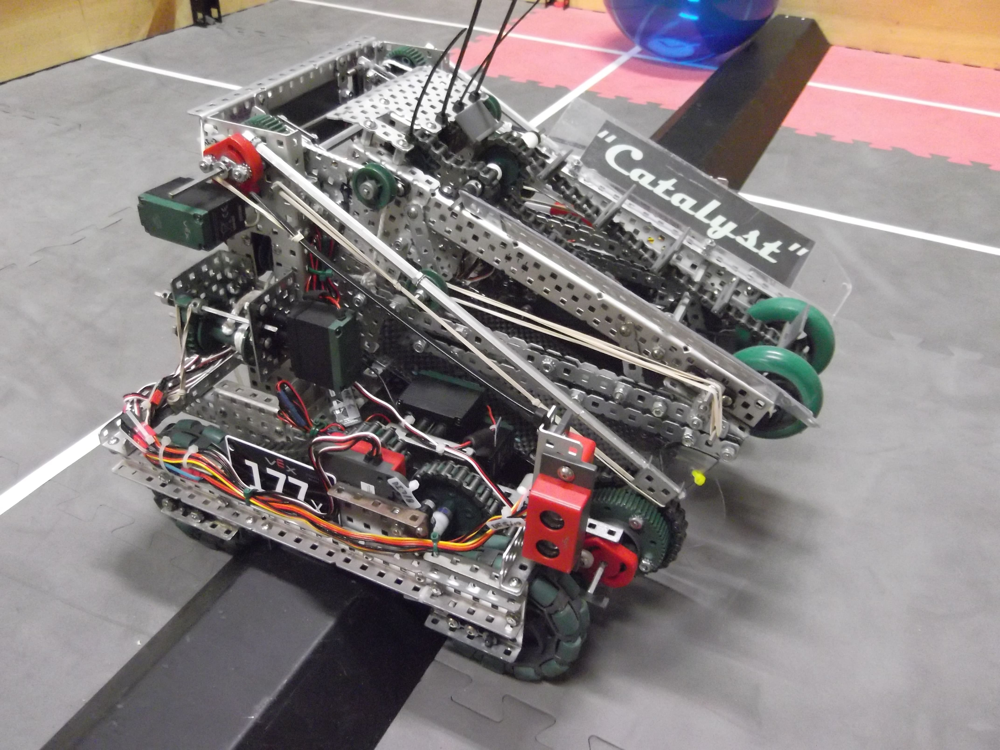
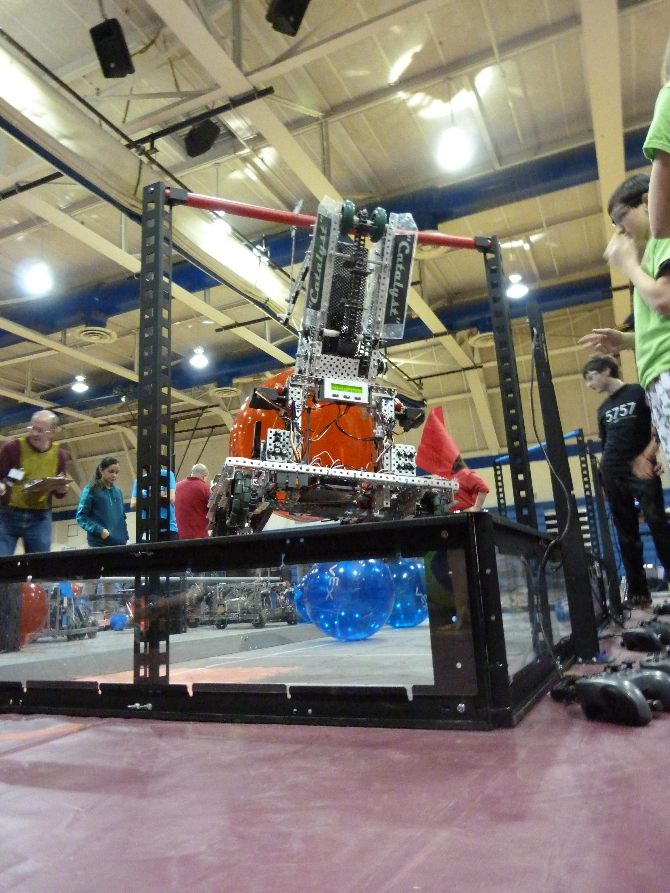

VEX Robotics Competition Team 177 were the Twisted Botz of Gloucester, Hanover, and later Richmond, VA.
[VEX Robotics Competition](https://www.robotevents.com/robot-competitions/vex-robotics-competition)
is the world's largest robotics competition. Teams from an ever-increasing number of countries 
enter their robots to play two-on-two on a 12' by 12' field.


Matches are two robots on the *blue alliance* against two robots on the *red alliance*. Each competition begins with qualifying rounds and ends with a best-of-three elimination bracket where each alliance is three teams (two teams' robots play any given match). Robots must compete autonomously for the first fifteen seconds of each two-minute match; after this, the team may tele-operate their robot. Tim usually programmed in some autonomous features during the teleoperation period to limit human error.


A new competition game is released each year, so teams must
re-engineer their robots each year. Only a limited set of components are allowed, but most may be modified as needed. (Microcontrollers, batteries, etc. must not be modified.)

Tim joined the team in September of 2011 and became a robot captain in January of 2013.
While he was a member, the World Championship grew from
400 to 600 teams, and the percentage of teams from the USA dropped to about 60%.
[Click here](./awards.md) to see a list of awards the team earned while Tim was captain. Also note that Tim was the only programmer of all the robots listed below.

The Twisted Botz were [very successful](./awards.md), reaching the
VEX Robotics World Championship (a.k.a. VEX Worlds)
consistently every year. This put them in the top 10% of teams worldwide.
When Virginia grew large enough to have its own State Championship, the Twisted Botz were strong competitors each year.

The Twisted Botz are very recognizeable: we always wore bright green shirts. The Twisted Botz umbrella sometimes included multiple robots; Little Hawk entered as 177 (with no letter) but the remaining three robots entered as 177X.

### Spitfire I and II

Spitfire competed in [VEX Nothing but Net](https://youtu.be/A8daR6qBw3M).
The goal of this game was twofold:

* Get balls in the net (or under the rim for reduced points);
* Lift your partner or be lifted.

The robots' initial size was limited to an 18-inch cube.
Robots were only allowed to expand when in their own back corner, so the only allowable means of scoring balls in the net was to launch them.
Our team attempted to build a lifting mechanism in both versions one and two of Spitfire; neither design worked well, so we chose to specialize in ball-shooting.
[Click here to read the PID speed control code for Spitfire I (C include file).](Spitfire1PID.h)
[Click here to read the PID speed control code for Spitfire II (C include file).](Spitfire2PID.h)

Tim later redesigned Spitfire a second time on his own [and the lift worked.](./spitfire3.html)

Below are some videos of Spitfire in action. 

#### Spitfire 1 scores autonomously

<iframe src="https://cornell.app.box.com/embed/s/9sz848bq7r2b25epsj2u3b2qawlggwc5?sortColumn=date&view=list" width="500" height="400" frameborder="0" allowfullscreen webkitallowfullscreen msallowfullscreen></iframe>

#### Spitfire 1 in competition

<iframe src="https://cornell.app.box.com/embed/s/zfjreyz8ys066vfvuf94qav3ytw3wbg5?sortColumn=date&view=list" width="500" height="400" frameborder="0" allowfullscreen webkitallowfullscreen msallowfullscreen></iframe>

<iframe src="https://cornell.app.box.com/embed/s/mjuouek7ltx093igprqs7vpxg90s1d80?sortColumn=date&view=list" width="500" height="400" frameborder="0" allowfullscreen webkitallowfullscreen msallowfullscreen></iframe>

#### Spitfire 2 in practice

<iframe src="https://cornell.app.box.com/embed/s/rw2e4g964dgzmyifxp44sqsfne7qy5lf?sortColumn=date&view=list" width="500" height="400" frameborder="0" allowfullscreen webkitallowfullscreen msallowfullscreen></iframe>

#### Spitfire 2 at Worlds 2016

<iframe width="853" height="487" src="https://www.youtube.com/embed/hoWKCWjAxYA" frameborder="0" allow="accelerometer; autoplay; clipboard-write; encrypted-media; gyroscope; picture-in-picture" allowfullscreen></iframe>

### Overdrive

Overdrive competed in [VEX Skyrise](https://youtu.be/PJ-5H3JVtPs).
The goal of this game was fourfold:

* Score your color cubes on posts (and descore opponents' cubes when legal);
* Build your own post, called a Skyrise, from stackable yellow Skyrise sections;
* Score your color cubes on the Skyrise.

The robots' initial size was limited to an 18-inch cube.
Robots were allowed to expand without bound once the match began.

#### Problems and Solutions

##### Expanding Structure

A winning robot needed to become about six feet (2 m) tall to score on a fully-built Skyrise.

To accomplish this task, we initially chose a double four-bar linkage.
We rejected a scissor lift design on the basis of complexity and lack of flexibility.
The upper and lower linkages were separate to allow the robot to reach over obstacles.
This ability rarely proved useful, and two separate linkages increased structural load and decreased stiffness.
Furthermore, it required us to use a control loop to keep the two in sync.
So, in Overdrive 2.0, we geared the two linkages together, eliminating significant complexity.
The upper and lower linkages of Overdrive 2.0 were mirror images in 2-D, so the in-plane motion of the linkage was almost perfectly linear.

<iframe src="https://cornell.app.box.com/embed/s/4kcvh60hlyihr5gfihk59zizoqfgzqrf?sortColumn=date&view=list" width="500" height="400" frameborder="0" allowfullscreen webkitallowfullscreen msallowfullscreen></iframe>

##### Out-of-plane motion

The linkages were obviously designed to move in their respective planes.
Since we had not yet studied statics, we didn't understand all the bending and torsion loading that
structure needed to endure.

The biggest issue was that the two sides were separately actuated,
so they could move out of sync and twist the entire structure.
Even if we used a proportional controller to hold the two sides in sync,
resisting side-to-side moment loads took its toll on the motors, so
sometimes the lower linkage motors overheated.

To solve this problem, we had to mechanically link the two
lower linkage motors. Then, the linkage was mostly straight up and down
(with the help of some structural stiffening.)

##### Picking and placing cubes

We chose a "needle intake" which reaches inside the hollow cubes because

* It was simpler and lighter than a mechanism which reached outside the cubes;
* It could hold the cubes regardless of their angle (unlike e.g. hooks).

To simplify driving and reduce the number of actuators, we used
a ratchet mechanism: pushing the needle through a cube latched the cube, and
extending a pneumatic piston released the ratchet. We chose pneumatics because

* Our only allowed pneumatics were solenoid-operated and thus binary (on/off);
* We were limited to ten motors and wanted to use them for applications requiring more than two positions.

We initially attempted to make an omni-directional needle. While it worked, the
size of the ratchet mechanism made picking up cubes difficult. We attempted to build a cone on the bottom to help align the cubes, but
the needle was too narrow and flimsy.

So, for Overdrive 2.0, we redesigned the needle to handle two cube positions:

1. Sides parallel and normal to the robot (straight on);
2. Sides 45° to the robot (crooked).

All sides of the needle were thus 90° or 45° to the front of the robot.
We used a funnel-shaped bumper surface of the robot to align the cubes
under the needle, so driving the robot into a cube prepared it to pick a cube.
If the cube was not perfectly straight or perfectly crooked, angled surfaces of the needle
shoved the cube into one of those positions as the heavy linkage dropped on it.

##### Programming

Though redesigning Overdrive radically simplified the control of the arm, it was still in our favor to use a good control algorithm for driving and for moving the arm. Below is a simple function for predictably driving straight. Note that the two drive encoders, connected via I²C, were labeled `I2C_1` and `I2C_2` in the order of series connection.

```c
//Drive straight a certain number of encoder ticks
void Drive(int ticks, int power)
{
	SensorValue[I2C_1] = 0;
	SensorValue[I2C_2] = 0;
	if(ticks > 0)
	{
		while(SensorValue[I2C_1] < ticks)
		{
			difference = SensorValue[I2C_1] + SensorValue[I2C_2];
			//I2C_2 goes negative when the bot goes forward
			motor[LRDrive] = motor[LFDrive] = power - difference;
			motor[RRDrive] = motor[RFDrive] = power + difference;
			wait1Msec(10);
		}
	}
	if(ticks < 0)
	{
		while(SensorValue[I2C_1] > ticks)
		{
			difference = SensorValue[I2C_1] + SensorValue[I2C_2];
			//I2C_2 goes negative when the bot goes forward
			motor[LRDrive] = motor[LFDrive] = -power - difference;
			motor[RRDrive] = motor[RFDrive] = -power + difference;
			wait1Msec(10);
		}
	}
	motor[LRDrive] = motor[LFDrive] = motor[RRDrive] = motor[RFDrive] = 0;
}

```

And the following code (written partially by a team mentor) uses a PI controller to position the arm predictably.

```c
//------------------------------------------------------------------------
// This task runs two PID controllers to position the two lower arms
// and the upper arm assembly
// Both setpoint and measurements are normalized to 0..100%
//------------------------------------------------------------------------

float SetPt;						// Setpoint for arm position

// Right Side Arm PID Values
int Ceiling = 2470;		// Right Side Full Up Value from Pot
int Floor = 700;				// Right Side Full Down Value from Pot
float Slope = 1;				// Right Side Slope of Pot
float CurrP;						// Current Position (0-100)
float PrevP;						// Previous Position

float CurrError = 0;		// Current Error
float PrevError = 0;		// Previous Error
float dP;								// Change in position, this iteration
float Proportional = 0;// Proportional Term of Left Side PID
float Int = 0;					// Integral Term of Left Side PID
float Deriv = 0;				// Derivative Term of Left Side PID
int Output = 0;						// Calculated Arm Motor Power

// Shared Values
float deltaT;							//Change in time (used for calculating dP/dt)
float Prop_Gain = 6;		// PID Tuning Constants
float Int_Gain = 0.8;
float Deriv_Gain = 0;

task armcontrol()
{
	//Initialize values
	Slope = (Ceiling - Floor)/100;		// dy/dx - normalized to 100
	Output = 0;
	deltaT = .005;
	clearTimer(T1);							// Reset Timer T1
	PrevP = (SensorValue[ArmPot] - Floor) / Slope;
	wait1Msec(5);

	do
	{
		deltaT = time1[T1]/1000;	// Time in seconds
		clearTimer(T1);						// Reset the timer T1

		// Scale current sensor values
		CurrP = (SensorValue[ArmPot] - Floor) / Slope;

		// Limit setpoint to 0..100

		if(SetPt < 0)
			SetPt = 0;
		if(SetPt > 100)
			SetPt = 100;

		// Define error values based on setpoint
		// Lower arm error uses average of two lower pots
		PrevError = SetPt - PrevP;
		CurrError = SetPt - CurrP;
		//if(abs(SetPt - CurrP) > 0.1)			//Deadband
		//	CurrError = SetPt - CurrP;
		//else
		//	CurrError = 0;

		// Update differentials
		dP = CurrError - PrevError;

		// Update P, I, and D
		// Proportional Term
		Proportional = Prop_Gain * CurrError;

		// Integral Term

		Int = Int + Int_Gain * CurrError * deltaT;

		// Derivative Term
		if(deltaT > 0)
		{
			Deriv = Deriv_Gain * (dP / deltaT);
		}

		// Update motor values

		if (Int > 100)
			Int = 100;	// Adjust the integral term to prevent integral windup
		if (Int < -100)
			Int = -100;

		Output = Proportional + Int + Deriv;

		//Limit motor values to -127 < PWM < 127
		if(Output < -127)
			Output = -127;
		if(Output > 127)
			Output = 127;

		// Update motor power
			motor[LRArm] = motor[LLArm] = motor[URArm] = motor[ULArm] = Output;

		//Update previous values
		PrevError = CurrError;
		wait1Msec(1);
	}
	while(true);
}

```

#### Overdrive in Action

##### Overdrive 1.2 Stars in Local Tournament

<iframe src="https://cornell.app.box.com/embed/s/fqirs6zo1p5m4f9zpbjzvg8cpg3eteyh?sortColumn=date&view=list" width="500" height="400" frameborder="0" allowfullscreen webkitallowfullscreen msallowfullscreen></iframe>

##### Overdrive 2.0 Scores Autonomously

<iframe src="https://cornell.app.box.com/embed/s/gbweba06mkx714wln6wtom9kb5nveljf?sortColumn=date&view=list" width="500" height="400" frameborder="0" allowfullscreen webkitallowfullscreen msallowfullscreen></iframe>

<iframe src="https://cornell.app.box.com/embed/s/n5azptkix9fx0ifmouandrux2zhyhnpz?sortColumn=date&view=list" width="500" height="400" frameborder="0" allowfullscreen webkitallowfullscreen msallowfullscreen></iframe>

##### Overdrive 2.0 at Worlds

* [Camera focuses on Overdrive building a Skyrise](https://www.youtube.com/watch?v=4bconKdFa7M)
* [Our highest score](https://www.youtube.com/watch?v=-IJEN-o_RMc)
* [Division finals](https://youtu.be/R2ZVlhGhXQI)

### Catalyst

Catalyst was the Twisted Botz' first of two competing robots in [VEX Toss Up](https://youtu.be/gsq2qjjNwPU).


#### Problems and Solutions

##### Balls that Aren't Round

VEX Toss Up featured two objects to be scored: *large balls*, weighted beach balls; and *buckyballs*, plastic truncated icosahedrons (the shape of the buckyball molecule, C₆₀.) For efficient scoring, our robot carried three buckyballs (the maximum allowed), picking and dispensing them using a modified conveyor belt with flexible flaps. The intake system, as it was called, needed to have zero rigid parts to handle the oddly-shaped balls. The front of the belt was supported by a springloaded arm which pressed on the balls to prevent them from falling out, while allowing the balls to enter and leave from many angles.


To score the large balls, which were nearly as big as the robot itself, Catalyst used two forks which slid under the balls and lifted them on top of the robot. By lifting the arm suddenly, the robot could toss the balls over the fence-like barrier to score points.


##### Speed Bump

The robots in Toss Up needed to be no taller than 12" in order to pass under a barrier; they also needed substantial ground clearance to cross a trapezoidal *bump*. Though it was a minor speed bump for a car, the 2" tall trapezoidal bump posed a major obstacle for the robots whose wheels were 3-5" in diameter. Our team chose (as did most) to use wheels rather than tracks to cross the barrier, but all four wheels had to be powered with sufficient torque to push the robot over the steep bump. Crossing the bump too many times tended to overheat the motors.



We limited the overheating problem by setting a `stall` variable in each loop of the tele-operation code. If the wheel encoders measured too low a speed with too great a motor power command, the motor power was divided by four, limiting the current to the motors.

The high ground clearance led to worse-than-usual stability problems. Nearly everything on the robot needed to be at least 2" above the ground, so the Catalyst's center of gravity was high. Raising the arm moved the center of gravity backward, and the arm was geared at a relatively high ratio so it could toss balls, so it was easy to flip the robot by raising the arm suddenly or by driving forward suddenly with the arm raised. Catalyst compensated for this by using a gyroscope sensor to measure the robot's attitude. (The accelerometer measured horizontal accelerations as well, and Catalyst accelerated quickly, so we used the gyroscope.) When Catalyst tilted backward with its arm raised, the robot drove backward. The backward compensation was proportional to the measured tilt angle.


Below is the user-control code with anti-tip and anti-stall implemented.

```c
task usercontrol()
{
	//Zero encoder values
	SensorValue[LEncoder] = SensorValue[REncoder] = 0;
	//------------------------------------------
	//Show battery voltages during tele-op mode:
	//Turn on LCD Backlight
	bLCDBacklight = true;
	string mainBattery, backupBattery;
	int l1 = 0;
	int l2 = 0;
	int r1 = 0;
	int r2 = 0;
	bool lstall = false;
	bool rstall = false;
	//Turn off all SONAR
	SensorType[LeftSonar] = SensorType[LFrontSonar] = sensorNone;
	SensorType[RFrontSonar] = SensorType[RightSonar] = sensorNone;
	while (true)
	{
		//--------------------------------
		//Display battery voltages on LCD
		clearLCDLine(0);
		clearLCDLine(1);

		//Display the Main Robot battery voltage
		displayLCDString(0, 0, "Main: ");
		//Build the value to be displayed
		sprintf(mainBattery, "%1.1f%c", nImmediateBatteryLevel/1000.0,'V');
		displayNextLCDString(mainBattery);

		//Display the Backup battery voltage
		displayLCDString(1, 0, "Backup: ");
		//Build the value to be displayed
		sprintf(backupBattery, "%1.1f%c", BackupBatteryLevel/1000.0, 'V');
		displayNextLCDString(backupBattery);

		//------------------
		//Anti-stall system:
		//Determine the speed of the robot, in ticks per 1/20 second
		l1 = SensorValue[LEncoder];
		r1 = SensorValue[REncoder];
		wait1Msec(50);
		l2 = SensorValue[LEncoder];
		r2 = SensorValue[REncoder];
		rspeed = r2 - r1;
		lspeed = l2 - l1;

		//Define "stalling"
		if((vexRT[Ch3] - vexRT[Ch4]) > 43 && rspeed < 2)
			//If the right drive is stalling and the motors are running forward
		{
			rstall = true;
		}
		if((vexRT[Ch3] - vexRT[Ch4]) < -43 && rspeed > -2)
			//If the right drive is stalling and the motors are running backward
		{
			rstall = true;
		}
		else
		{
			rstall = false;
		}
		if((vexRT[Ch3] + vexRT[Ch4]) > 43 && lspeed < 2)
			//If the left drive is stalling and the motors are running forward
		{
			lstall = true;
		}
		if((vexRT[Ch3] + vexRT[Ch4]) < -43 && lspeed > -2)
			//If the left drive is stalling and the motors are running backward
		{
			lstall = true;
		}
		else
		{
			lstall = false;
		}

		//------------------------------------------------------
		//Drive controls with auto-stabilization and anti-stall:
		//Zero gyro sensor when arm is down; otherwise the gyro will eventually give false readings
		//so the bot thinks it's tipping when it isn't
		if(SensorValue[ArmPot] > 1900)
		{
			SensorValue[pitch] = 0;
		}
		//If the arm is up (when the bot usually falls over) and the bot starts to tip backwards
		//(outside a threshold value) slow or stop the motors so the bot can stabilize
		//Also skips this if the override button [6U] is pressed
		if(SensorValue[ArmPot] < 1860 && SensorValue[pitch] < -10 && vexRT[Btn6U] == 0)
		{
			motor[LFDrive] = motor[LRDrive] = (vexRT[Ch3] + vexRT[Ch4] / 2) + SensorValue[pitch];
			motor[RRDrive] = motor[RFDrive] = (vexRT[Ch3] - vexRT[Ch4] / 2) + SensorValue[pitch];
		}
		else //Otherwise, normal arcade drive with anti-stall
		{
			if(vexRT[Btn5U] == 1) //"Bump button" which both holds the arm up and overrides anti-stall
			{
				SetPt = 32;
				startTask(ArmPosition);
				while(vexRT[Btn5U]==1)
				{
					motor[RRDrive] = motor[RFDrive] = (vexRT[Ch3] - vexRT[Ch4])*0.8;
					motor[LFDrive] = motor[LRDrive] = (vexRT[Ch3] + vexRT[Ch4])*0.8;
					//Intake control
					motor[intake] = vexRT[Btn6UXmtr2] * 120 - vexRT[Btn6DXmtr2] * 120;
				}
			}
			stopTask(ArmPosition);
			//Slow down motors if they're stalling
			if(rstall == true)
			{
				//Slow arcade drive--right side
				motor[RRDrive] = motor[RFDrive] = (vexRT[Ch3] - vexRT[Ch4]) / 4;
			}
			else
			{
				//Fast arcade drive--right side
				motor[RRDrive] = motor[RFDrive] = vexRT[Ch3]*0.8 - vexRT[Ch4]*0.65;
			}
			if(lstall == true)
			{
				//Slow arcade drive--left side
				motor[LFDrive] = motor[LRDrive] = (vexRT[Ch3] + vexRT[Ch4]) / 4;
			}
			else
			{
				//Fast arcade drive--left side
				motor[LFDrive] = motor[LRDrive] = vexRT[Ch3]*0.8 + vexRT[Ch4]*0.65;
			}
		}

		//----------------------------------------------------
		//Arm control with limits and threshold
		if(SensorValue[ArmPot] > 670 && SensorValue[ArmPot] < 2650 && abs(vexRT[Ch2]) > 10)
		{
			motor[RArm] = motor[LArm] = vexRT[Ch2];
		}
		else if(SensorValue[ArmPot] < 670 && vexRT[Ch2] < 0)
		{
			motor[RArm] = motor[LArm] = vexRT[Ch2];
		}
		else if(SensorValue[ArmPot] > 2650 && vexRT[Ch2] > 0)
		{
			motor[RArm] = motor[LArm] = vexRT[Ch2];
		}
		else
		{
			motor[RArm] = motor[LArm] = 0;
		}
		//Intake control
		motor[intake] = vexRT[Btn6UXmtr2] * 120 - vexRT[Btn6DXmtr2] * 120;
		//Fork control with limits
		if(SensorValue[ForkPot] > 850 && SensorValue[ForkPot] < 3420)
		{
			motor[forks] = vexRT[Btn5UXmtr2]*120 - vexRT[Btn5DXmtr2]*120;
		}
		else if(SensorValue[ForkPot] < 850 && vexRT[Btn5UXmtr2] == 1)
		{
			motor[forks] = vexRT[Btn5UXmtr2]*120 - vexRT[Btn5DXmtr2]*120;
		}
		else if(SensorValue[ForkPot] > 3420 && vexRT[Btn5DXmtr2] == 1)
		{
			motor[forks] = vexRT[Btn5UXmtr2]*120 - vexRT[Btn5DXmtr2]*120;
		}
		else
		{
			motor[forks] = 0;
		}

		//Hanging system control
		motor[LWinch] = motor[RWinch] = vexRT[Btn8UXmtr2]*120 - vexRT[Btn8DXmtr2]*120;
	}
}
```

In demonstrations, we sometimes challenged visitors to flip Catalyst. It was not easy.

##### Hanging

The largest point bonus in Toss Up was awarded to a team whose robot hung 12" off the ground from a 40" tall bar, while holding a large ball. Catalyst's front forks, which were separate from its simple arm, allowed it to hold a large ball while the arm reached up to grab the bar with hooks. The hooks were pulled downward by a winch on the robot's base, keeping the center of gravity low.



#### Catalyst in Action

<iframe src="https://cornell.app.box.com/embed/s/ztyxbn1dkw2x1m7o3rga3ote9hwaemt4?sortColumn=date&view=list" width="500" height="400" frameborder="0" allowfullscreen webkitallowfullscreen msallowfullscreen></iframe>

### Little Hawk

Little Hawk was the Twisted Botz' second of three competing robots in [VEX Sack Attack](https://youtu.be/N-ehrKSYfjk).

The game revolved around *sacks* (5" by 5" beanbags) which could be scored in the low, the high, or the floor goal.
The low goals were wide troughs and the high goals were flat rimmed plates. The floor goals were colored squares in the floor of the field.

The sacks were team-agnostic; they counted for the side whose color goal they were scored in.
The sacks could be both scored (dropped in the goals) and descored (removed from the goals).
Frequently a team descored from an opponent's goal to score in their own.

#### Problems and Solutions

##### Robots and Beanbags??

On a foam floor, the sacks were not easy for a robot to handle since they were nonrigid.
Rather than grippers, the winning teams employed large mechanisms
which engulfed the sacks wherever they could be, since their precise positions and orientations were unknown.
Two winning designs emerged:

* Roller intakes: like a combine harvester, these robots rolled over the beanbags and sucked them into a hopper.
* Scoops: somewhere between a front-end loader and a forklift, these robots pushed thin forks or scoops under the beanbags and stored them in a designated place.

Our robot was a scoop. Although the world champions all used roller intakes, we nearly defeated them
since we could shove our scoop under their "nose" while they tried to defend their goal.

##### Heavy Loads

Each sack weighed 0.5 lb. There were 104 sacks on the field. So, the winning teams carried many sacks at a time.
For a 15-20 lb robot, five pounds of sacks is quite a lot. Our robot routinely carried five pounds (it could carry seven).
We initially reused an old design with two cheap gearmotors connected on the same axle. When the two
motors went out of sync, the gears locked and the lift stopped working. We solved this problem redundantly: we used the best legal motors and we connected them via chains, which provided enough leeway that they could stop at slightly different angles without needing to backdrive.
To avoid backdriving, we hard-coded a small power signal to the motors to counteract the effect of gravity.

#### Other Accomplishments

Tim had never written C code before. Our team used [RobotC](https://www.robotc.net), so Tim learned to program via tutorials and trial-and-error.

A more experienced team captain congratulated Tim, "That's an awesome autonomous."
