## Cornell Mars Rover

[Cornell Mars Rover (CMR)](https://marsrover.engineering.cornell.edu) designs and builds a new robotic rover each year for the [University Rover Challenge (URC)](https://urc.marssociety.org), a competition for which universities must present design reviews of their rover. Then, the URC judges choose the top 30 teams based on the quality of their design reviews. These top 30 compete in the harsh Mars-like environment of Hanksville, Utah, to determine which team's rover is most suitable to be sent to Mars. CMR has ranked among the top thirty every year since 2012. 

CMR now has eight [subteams](https://marsrover.engineering.cornell.edu/subteam.html), seven of which are technical. These eight subteams consist of [about 50 members](https://marsrover.engineering.cornell.edu/team.html).
Tim was the first leader of the AstroTech subteam when Argos was designed.

### [Argos (2020)](https://marsrover.engineering.cornell.edu/rovers.html)

#### Tim's Role

The brand-new AstroTech subteam develops the rover's on-board robotic science lab! As lead, Tim was essentially the project manager of this subsystem. He did both technical work (designing and helping his members design; manufacturing) and administrative work (keeping the inter- and intra-subteam communication going; and lots of documentation!)

The *science payload frame*, the outer section which hold together, raises, and lowers the entire subsystem, was Tim's design since it interfaced the individual components designed by the other AstroTech members.

[**Click here to read the final report for the design of the science payload frame (23-page PDF)**](https://1drv.ms/b/s!AmJ2drz6YYLg5R4GlBf_5VAdomzQ?e=62aGbp)

#### COVID-19

Due to the risks and restrictions due to COVID-19, the URC staff chose to cancel the competition. However, [CMR made the finals](http://urc.marssociety.org/home/urc-news/announcingtheurc2020finalsqualifiers) and aims for first place in URC 2021!

### [Artemis](https://marsrover.engineering.cornell.edu/rovers.html)

<iframe width="873" height="498" src="https://www.youtube.com/embed/KvGK0PksWZA?t=109" frameborder="0" allow="accelerometer; autoplay; clipboard-write; encrypted-media; gyroscope; picture-in-picture" allowfullscreen></iframe>

#### Tim's Role

##### Base Joint

Tim, as a junior, designed the base joint of the rover's arm: the largest joint that swings the arm right and left (about the rover's z-axis.)

ANSYS results led Tim to add an additional sleeve bearing to prevent sideways wobble.

He manufactured the most difficult parts and debugged torque transmission issues.

##### Science (AstroTech) Testing Lead

Tim was responsible for coordinating different tasks, ranging from soil NPK tests to assembly of a mini conveyor system, among a multidisciplinary team. The science system is the rover's geology configuration. Using optical filters, a temperature sensor, an auger, and a machine that flocculates (mixes with water to precipitate out minerals) soil, our rover can determine the presence of life on Mars.

#### Results

[Artemis placed sixth in the world in URC 2019!](http://urc.marssociety.org/home/about-urc/urc2019-scores)

CMR scored 307.87 out of a possible 500 points; the champions scored 362.9. CMR scored 90/100 in the science mission.

While the base functioned perfectly during the competition, the science subsystem failed to collect soil. It had been tested on rocky soil (and it collected mostly rocks); the soil at the competition was not the native Utah soil, but specially-prepared silt and sand mixtures. This lesson carried on to the redesign of the onboard science lab of Argos.

### [Valkyrie (2018)](https://marsrover.engineering.cornell.edu/rovers.html)

<iframe width="873" height="498" src="https://www.youtube.com/embed/54MQdJD8Xhg?t=103" frameborder="0" allow="accelerometer; autoplay; clipboard-write; encrypted-media; gyroscope; picture-in-picture" allowfullscreen></iframe>

#### Tim's Role

Tim, as a sophomore, worked with Graham Wilcox on the end effector (in this case, the gripper) of the rover's robotic arm. We 3D-printed several prototypes and iteratively chose a design with a springloaded thumb that molds around the objects it grips.

#### End Effector Requirements

Based on URC guidelines and feedback from more experienced team members, the EE had to

* Pick rectangular, circular, and odd-shaped objects off the ground
* Hold objects stationary relative to the end effector
* Hold electronics board with Molex connector; unplug one and plug in another
* Hold screwdriver and turn screw
* Hold wrench and turn nut
* Hold and move joystick
* Type a few letters on a keyboard

##### Satisfying the Requirements

Using morph charts and Pugh decision matrices, Tim chose to grip various types of objects using a round finger and a flat finger to guarantee at least three lines of contact (i.e. points of contact in 2-D) for any object. His first design was tentative since the URC guidelines had not been released yet. The first redesign attempted to tackle all the problems in the simplest way.

The end effector needed the capability to pick a very small object from a flat surface (assuming the ground is flat or slightly concave). Thus, the arc swept by the fingers in 2-D needed to be tangent to the ground at the point where the fingers would grip the smallest grippable object. Based on competition experience, we planned to pick objects no smaller than 0.25" in thickness/diameter. URC guidelines restricted grippable objects to 2" (5cm) in diameter, though we designed for slightly oversized objects due to a task in which we grabbed rocks of unspecified size.

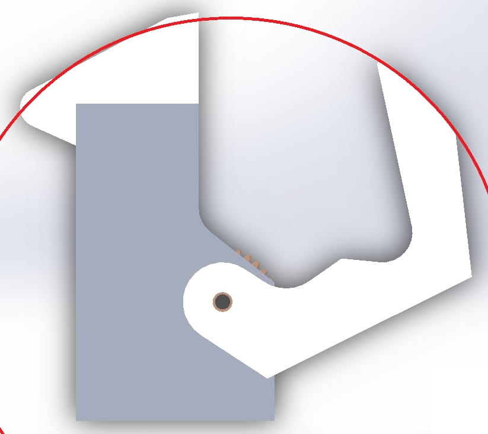

We believed the electronics board to be exposed with a protruding connector; at competition we found that it had a handle. However, designing for gripping connectors proved useful as the following year's competition required us to plug in a USB drive.

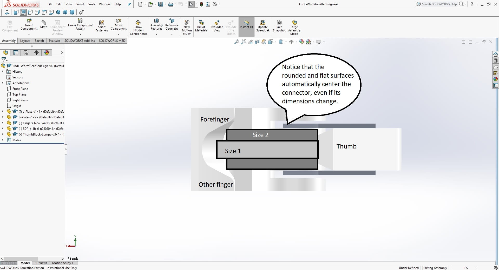

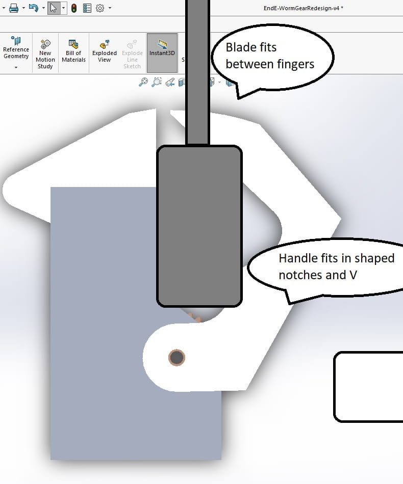

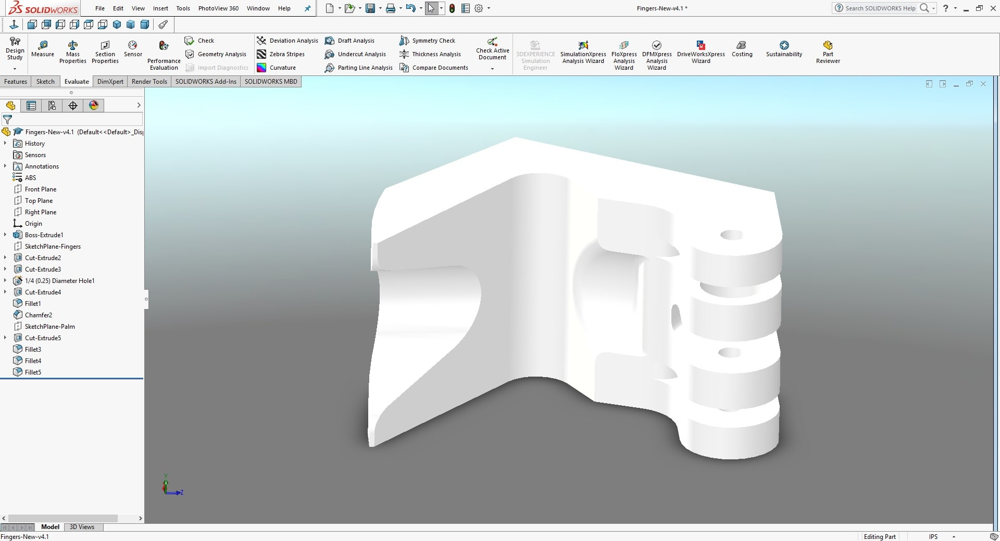

The V-notch allowed the fingers to maintain 3 lines of contact with round or rectangular objects of unknown size.

Maybe most importantly, the end effector needed to hold objects of unknown shape and size still. This design solved this issue using overlapping fingers. 

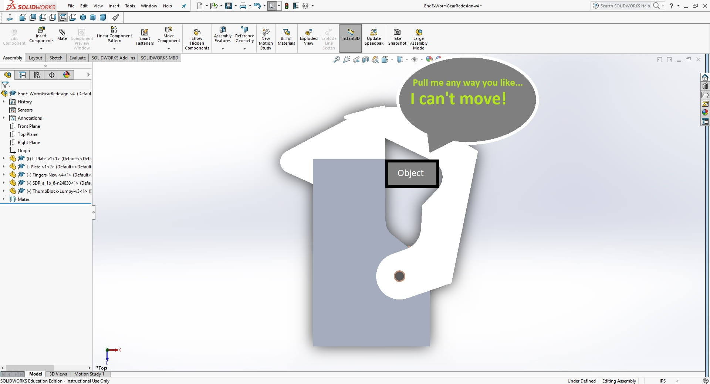

This design was limiting, however, because the shape of the fingers was dictated by the palm and V-notch for holding the screwdriver, and the grip surfaces at the front limited the amount of overlap.

##### Intervening finger designs

Each of the following designs was 3D-printed and attached to a test piece. Tim or Graham then attempted to grip various types of objects by manually moving the fingers.

Since objects were nearly always gripped at the fingertips, the place where there was no grip surface due to the overlap, the next design attempted to eliminate the overlap. Instead, if the robot needed to hold very small objects, it held them in a designated spot.

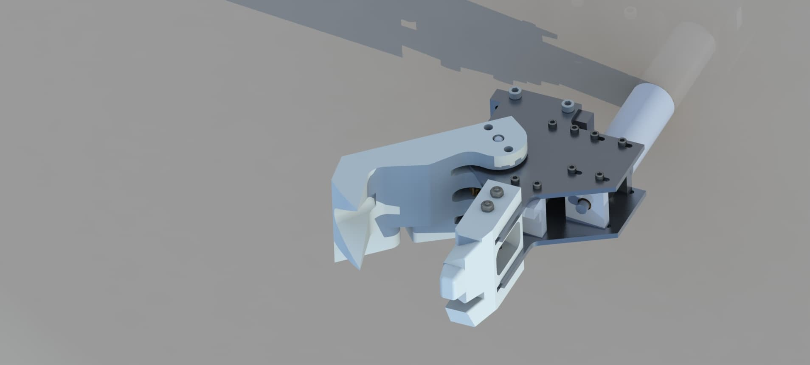

This did not work well, since the grip surface ceased to be flat once grip material (we used neoprene rubber foam) was applied.

The best design with simple fingers used a specially-shaped thumb; the foam flattened as the fingers' mating surfaces came together, and it could hold many different shapes. The concavity of the thumb matched the concavity of small round objects, and the foam dealt with flat objects. For larger objects, Tim expected the driver to use the back part of the gripper. Note the V-shaped notch for gripping the screwdriver, and the camera mount attached to the end effector.

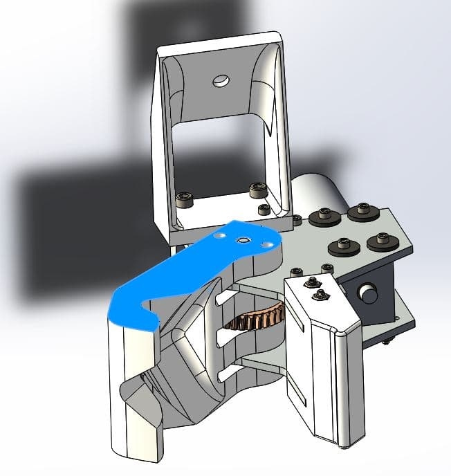

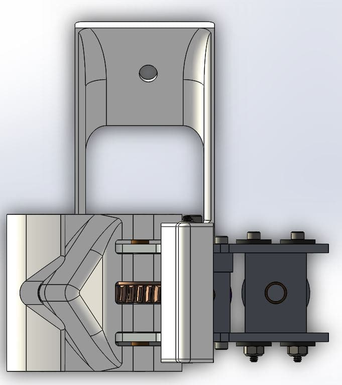

This design, assumed to be final, was shown in the fall 2017 semester end effector final report. [**Click here to access the final report (20-page PDF).**](https://1drv.ms/b/s!AmJ2drz6YYLg5R2a--UQL1KzWhzh?e=M9nT0Q)

#### Final Finger Design

In practice, the fingertips were always used to grip objects, and fitting the gripper around larger objects was difficult. So, the design needed to be all fingertip for holding bigger objects.

In addition, the simple finger designs could usually hold the object, even if the fingers were not the optimal shape, but the fingers often held it at an odd angle depending on how the fingers happened to hold the object. Worse, if the fingers closed on the wrong part of the object (e.g. halfway onto the handle of a screwdriver) the V-notch didn't work because the grip material prevented the object from sliding into the center of the notch. So the object was held at an awkward angle and either popped out or reoriented itself when it touched a stationary object.

Tim tried multiple ways to fix this.

1. Add a second joint in one of the fingers. Early in the year, the decision was made to use only one actuator (see below); so the joint needed to be springloaded or otherwise passive.
2. Use "claws" without grip material to grasp objects off-center; hard objects would be forced to the center of the gripper as the fingers closed. This design was modeled in SolidWorks but eliminated due to its unwieldiness and the structural properties of 3D-printed plastics.

The working design is shown below. Grip material was placed on the flat thumb (where it stuck well since the adhesive had a large surface area) and on the palm opposite the thumb. The palm was a complex lofted feature.

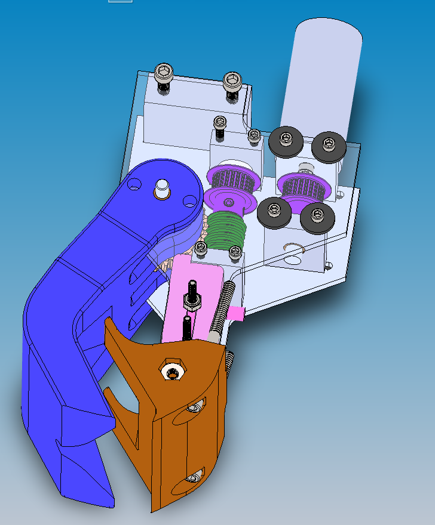

To save a step, a screwdriver and a cylinder (handles were the most common object) were modeled in CAD along with the end effector, and constrained to it. Using the transparency feature, Tim checked the mating of the end effector surfaces with handles of various sizes.

#### Other Design Features

The actuation of the end effector was redesigned from the previous year. 

* The end effector was controlled manually by spinning the motor for the right amount of time. (CMR was divided into subteams by discipline, so the EE majors needed the ME majors to finish the mechanicals before the electronic system could be debugged; putting sensors in the end effector was everyone's last priority.) Tim did not attempt to change this.

To prevent the fingers from opening when closed, CMR had used non-backdriveable gears: either worm gears or lead screws. Both tended to lock when overdriven due to the difficulty of stopping the motor at the perfect time.

In a previous year, CMR used a loose timing belt which unintentionally solved this problem by skipping teeth when overdriven. After the timing belt was a lead screw, which was large and heavy.

Tim chose to use rotating rather than sliding fingers to eliminate the bulky lead screw. The fingers were driven by a worm gear which was in turn driven by a timing belt functioning as a torque-limiting device. Obviously, timing belts are designed not to skip, so he used adjustable spacing for the timing belt so the team could make it skip at an appropriate torque. He moved the whole design to a plane to save room and minimize the part count. As a result, the motor protruded behind the EE, offset to one side to prevent collisions with the wrist joint. Graham, who was a freshman, designed the structure holding these sprockets and gears in place.

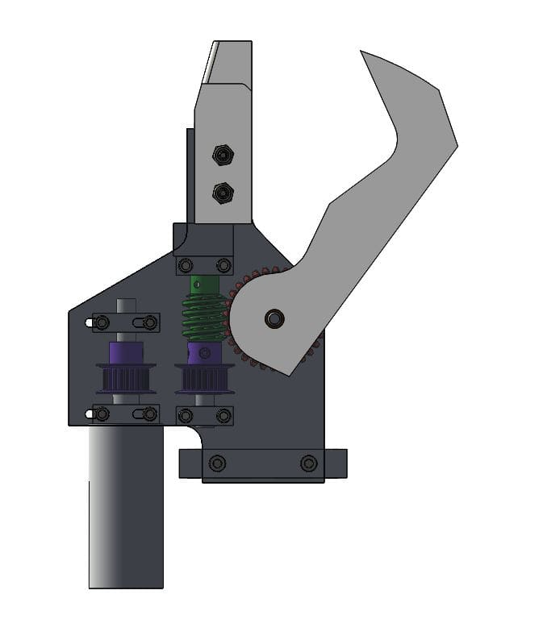

Note that the screws in the slots are prevented from slipping by rubber washers.

Another problem CMR had encountered was a bad shaft connection: the fingers had once been driven by a pinned joint which used a screw instead of a pin. Not only did the screw increase stress concentrations relative to a simple pin, but also our machining tolerances were not good and the screw could move in the hole. Tim avoided this problem entirely by bolting the fingers to the gear. By placing the connection points farther from the rotation axis, he limited the force on any individual screw, allowing the 3D-printed fingers to withstand the torque required to hold an object tightly and eliminating the need for tight-toleranced holes.

The one-piece 3D-printed finger block was carefully designed for simple assembly and servicing as well as structural strength. Holes in the top allowed screws to fit through between the two plates holding the joint. Sleeve bearings were pressed in the center holes, making a weak 3D-printed hole a strong bronze one. Nuts were placed in fitted hexagonal holes in the printed part. Stress concentrations were diminished using fillets on the appropriate corners.

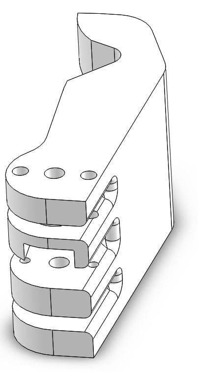

The entire design was analyzed in ANSYS for several expected loading cases. Though some of the full-assembly analyses did not converge (Tim had not yet taken FEA classes), each loaded component survived its tests. Some results are shown below.

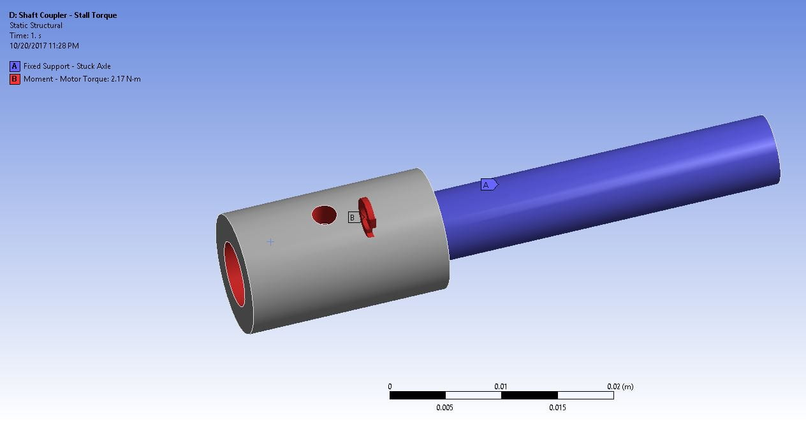
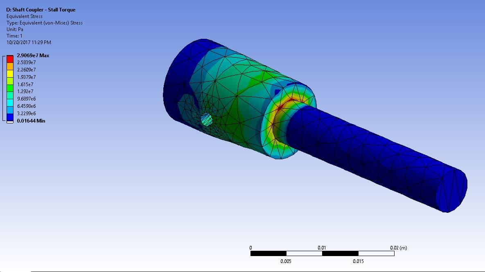

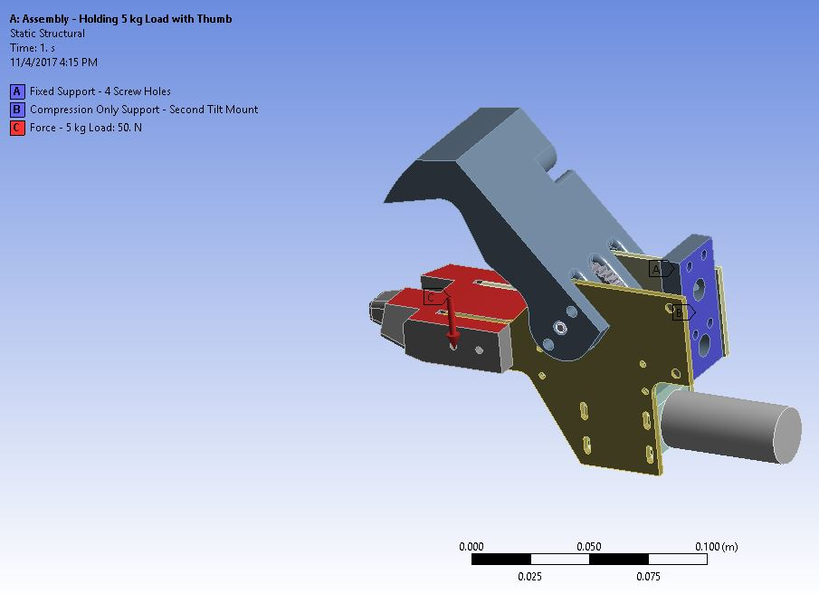
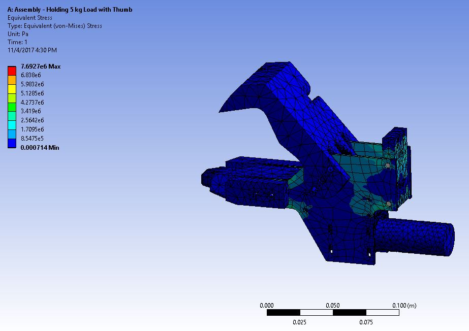

#### Results

[Valkyrie placed tenth in the world at URC 2018.](http://urc.marssociety.org/home/about-urc/urc2018-scores) 

At competition, the end effector was one of the most reliable parts of the rover; the operator liked it better than previous iterations. Competition showed us that its "palm" was roughly half an inch too narrow; this has been changed in the current design.

### [Athena (2017)](https://marsrover.engineering.cornell.edu/rovers.html)

<iframe width="873" height="498" src="https://www.youtube.com/embed/Ek7NBryLVxY" frameborder="0" allow="accelerometer; autoplay; clipboard-write; encrypted-media; gyroscope; picture-in-picture" allowfullscreen></iframe>

#### Tim's Role

Tim, as a freshman, worked with Varun Belur on the wrist joint of the rover's robotic arm. CMR decided to design two modular wrists, one with two degrees of freedom ("complex wrist") and one with one degree of freedom ("simple wrist"). 

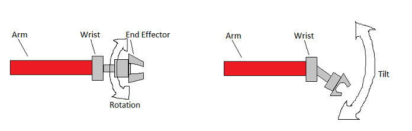

After a few weeks of training, Tim designed the simple wrist, which was more durable and had less backlash than the complex wrist.

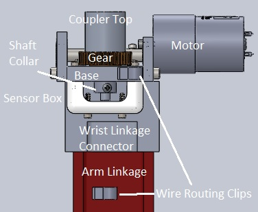

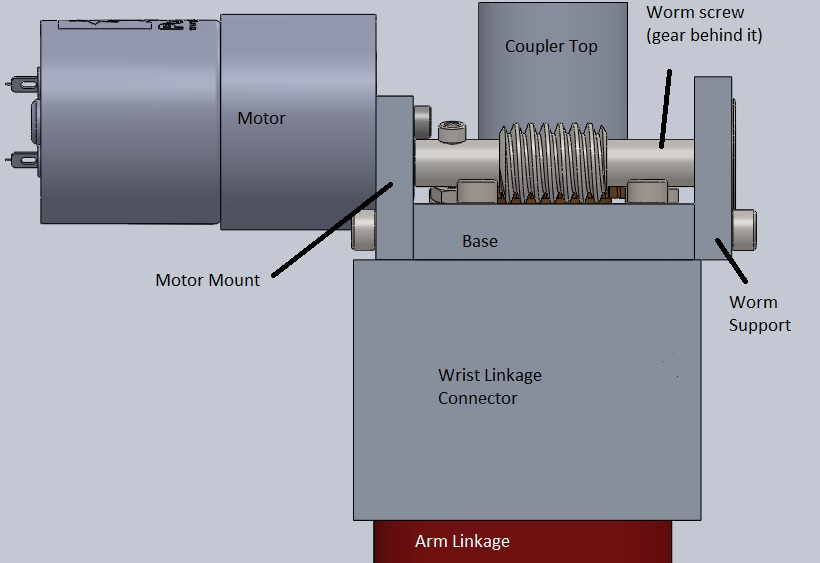

He was trained to perform analysis on the wrist in ANSYS. As ANSYS shows, the design was stiff and the maximum stresses were low.

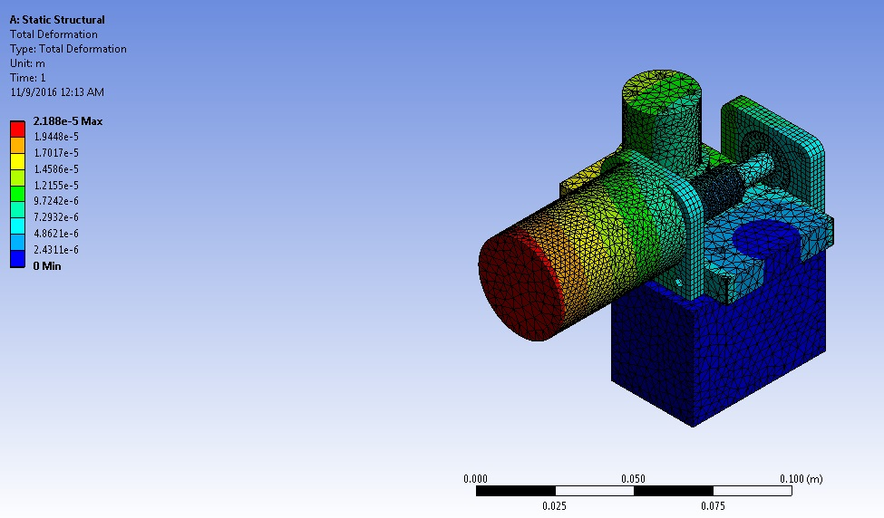
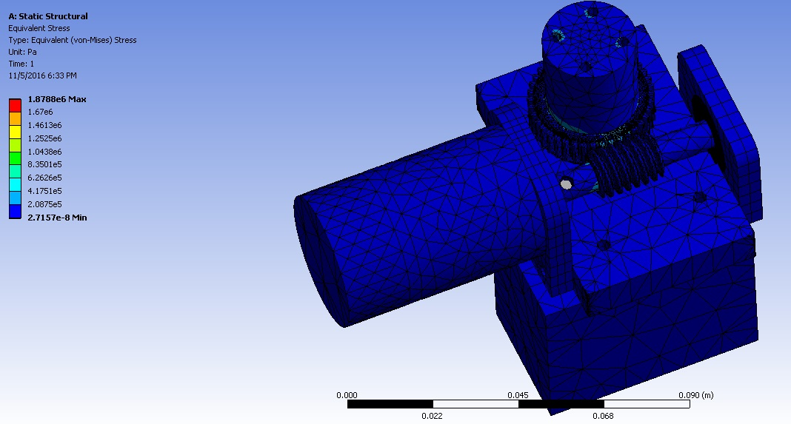

#### Results

[Athena placed eleventh in the world in URC 2017.](http://urc.marssociety.org/home/about-urc/urc2017-scores)
