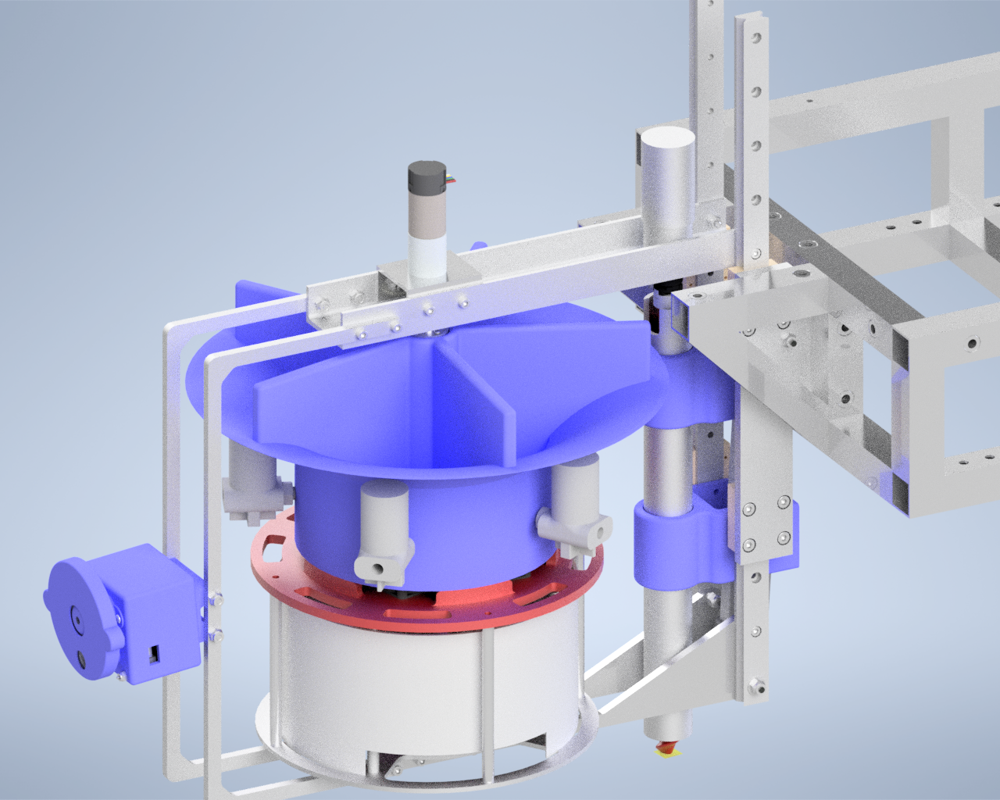
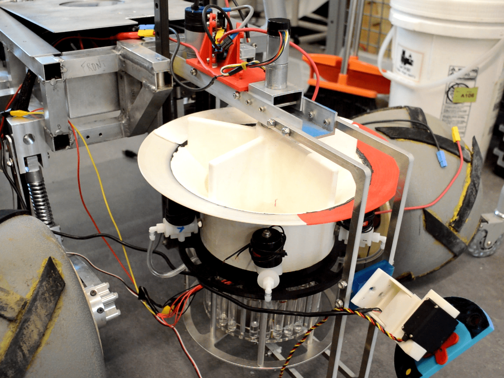
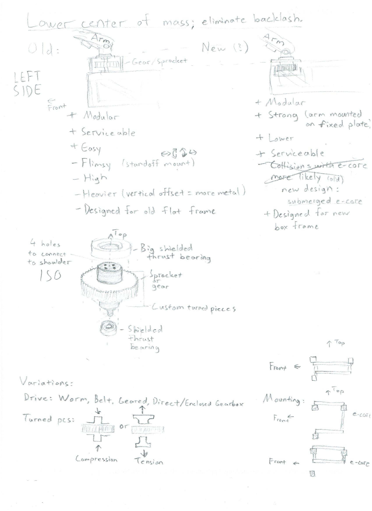
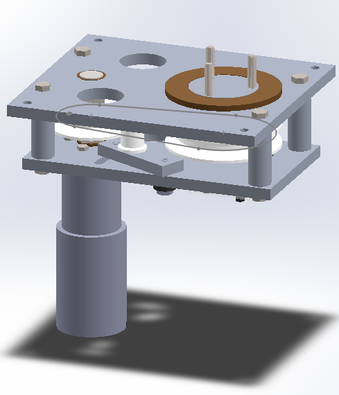
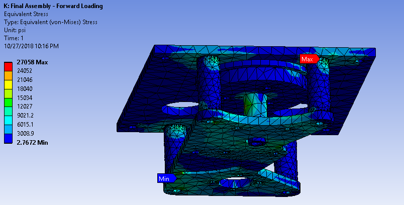
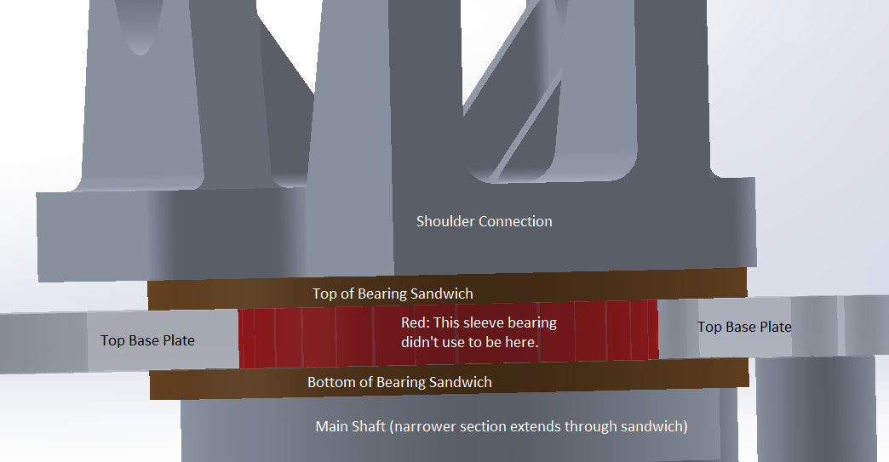
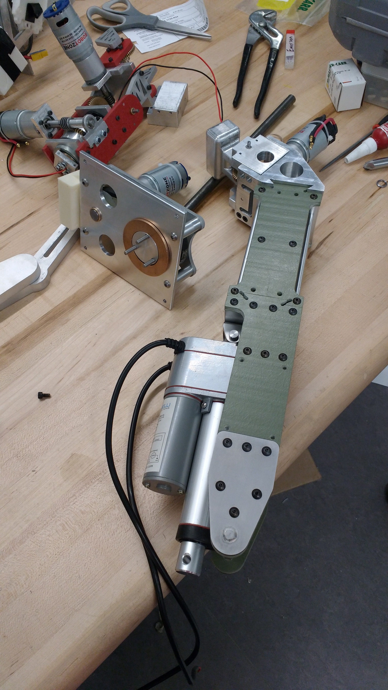

## Cornell Mars Rover

[Cornell Mars Rover (CMR)](https://marsrover.engineering.cornell.edu) designs and builds a new robotic rover each year for the [University Rover Challenge (URC)](https://urc.marssociety.org), a competition for which universities must present design reviews of their rover. Then, the URC judges choose the top 30 teams based on the quality of their design reviews. These top 30 compete in the harsh Mars-like environment of Hanksville, Utah, to determine which team's rover is most suitable to be sent to Mars. CMR has ranked among the top thirty every year since 2012. 

CMR now has eight [subteams](https://marsrover.engineering.cornell.edu/subteam.html), seven of which are technical. These eight subteams consist of [about 50 members](https://marsrover.engineering.cornell.edu/team.html).
Tim was the first leader of the AstroTech subteam when Argos was designed.

### [Argos](https://marsrover.engineering.cornell.edu/rovers.html)

#### Tim's Role

The brand-new AstroTech subteam develops the rover's on-board robotic science lab! As lead, I'm essentially the project manager of this subsystem. I do both technical work (designing and helping my members design; manufacturing) and administrative work (keeping the inter- and intra-subteam communication going; and lots of documentation!)

#### COVID-19

Due to the risks and restrictions due to COVID-19, the URC staff chose to cancel the competition. However, [CMR made the finals](http://urc.marssociety.org/home/urc-news/announcingtheurc2020finalsqualifiers) and shoots for first place in URC 2021!

### [Artemis](https://marsrover.engineering.cornell.edu/rovers.html)

<iframe width="873" height="498" src="https://www.youtube.com/embed/KvGK0PksWZA" frameborder="0" allow="accelerometer; autoplay; clipboard-write; encrypted-media; gyroscope; picture-in-picture" allowfullscreen></iframe>

#### Tim's Role

##### Base Joint

Tim designed the base joint of the rover's arm: the largest joint that swings the arm right and left (about the rover's z-axis.)

ANSYS results led Tim to add an additional sleeve bearing to prevent sideways wobble.

He manufactured the most difficult parts and debugged torque transmission issues.

##### Science (AstroTech) Testing Lead

Tim was responsible for coordinating different tasks, ranging from soil NPK tests to assembly of a mini conveyor system, among a multidisciplinary team. The science system is the rover's geology configuration. Using optical filters, a temperature sensor, an auger, and a machine that flocculates (mixes with water to precipitate out minerals) soil, our rover can determine the presence of life on Mars.

#### Results

(Artemis placed sixth in the world in URC 2019!](http://urc.marssociety.org/home/about-urc/urc2019-scores)

CMR scored 307.87 out of a possible 500 points; the champions scored 362.9. CMR scored 90/100 in the science mission.

While the base functioned perfectly during the competition, the science subsystem failed to collect soil. It had been tested on rocky soil (and it collected mostly rocks); the soil at the competition was not the native Utah soil, but specially-prepared silt and sand mixtures. This lesson carried on to the redesign of the onboard science lab of Argos.

### [Valkyrie](https://marsrover.engineering.cornell.edu/rovers.html)

<iframe width="873" height="498" src="https://www.youtube.com/embed/54MQdJD8Xhg" frameborder="0" allow="accelerometer; autoplay; clipboard-write; encrypted-media; gyroscope; picture-in-picture" allowfullscreen></iframe>

#### Tim's Role

Tim worked with Graham Wilcox on the end effector (in this case, the gripper) of the rover's robotic arm. We 3D-printed several prototypes and iteratively chose a design with a springloaded thumb that molds around the objects it grips.

#### Results

[Valkyrie placed tenth in the world at URC 2018.](http://urc.marssociety.org/home/about-urc/urc2018-scores) 

At competition, the end effector was one of the most reliable parts of the rover; the operator liked it better than previous iterations. Competition showed us that its "palm" was roughly half an inch too narrow; this has been changed in the current design.

### [Athena](https://marsrover.engineering.cornell.edu/rovers.html)

<iframe width="873" height="498" src="https://www.youtube.com/embed/Ek7NBryLVxY" frameborder="0" allow="accelerometer; autoplay; clipboard-write; encrypted-media; gyroscope; picture-in-picture" allowfullscreen></iframe>

#### Tim's Role

Tim worked with Varun Belur on the wrist joint of the rover's robotic arm. CMR decided to design two modular wrists, one with two degrees of freedom ("complex wrist") and one with one degree of freedom ("simple wrist"). After a few weeks of training, Tim designed the simple wrist, which was more durable and had less backlash than the complex wrist.

#### Results

[Athena placed eleventh in the world in URC 2017.](http://urc.marssociety.org/home/about-urc/urc2017-scores)
