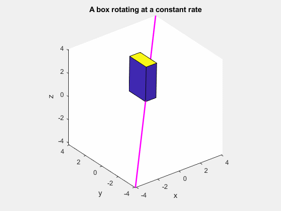

## Final project

#### Triple Pendulum

For the class final project, Tim (and other students) was instructed to animate a triple pendulum (three-link chain).
Each link was assumed rigid and each joint was assumed to have no backlash or friction.

Below are the results of three simulations, each solving different differential equations. Left to right:

1. The Newton-Euler equations
2. Differential Algebraic Equations (DAE)
3. The Lagrange equations

<image src="images/dynamics/3xPendulumNE.gif" width="30%"></image>
<image src="images/dynamics/3xPendulumDAE.gif" width="30%"></image>
<image src="images/dynamics/3xPendulumLE.gif" width="30%"></image>

To verify the solution, he compared the trajectories from the three different sets of equations. They were identical, as one would expect if the problem were solved correctly.

<image src="images/dynamics/All3LineUp.png" width="90%"></image>

#### Four-bar linkage

Students were also instructed to fix the end of the third link to an arbitrary position, forming a four-bar linkage.
He then simulated the un-forced motion of the linkage. The only external force acting on the linkage was gravity.

<image src="images/dynamics/4barLinkageDAE.gif" width="90%"></image>

<image src="images/dynamics/4barLinkageDAETrapezoid.gif" width="500"></image>

## 3-D dynamics simulation

*Intermediate Dynamics* students learned to analyze the motion of objects in 3-D. Translation is simple, since *F = ma* applies in one, two, or three dimensions. Rotation is more complex, since the moment of inertia is a tensor rather than a scalar.

Below is an animation of a box rotating about an arbitrary axis (shown in pink).

The following animations compare a the rotation of two boxes in free space. Their initial angular velocity is about an axis slightly offset from their principal axes. No moments are applied, yet the first one tumbles. The second is a cube, so its angular momentum matrix simplifies to a scalar multiple.

## Motion of a baseball with realistic air drag

<iframe src="https://cornell.app.box.com/embed/s/k5lxtdjqi1hvw3jo18to4e1jb8vmivsk?sortColumn=date&view=list" width="500" height="400" frameborder="0" allowfullscreen webkitallowfullscreen msallowfullscreen></iframe>

This is an animation of a baseball hit (launched) at a certain initial velocity. Second-order viscous drag is modeled.
