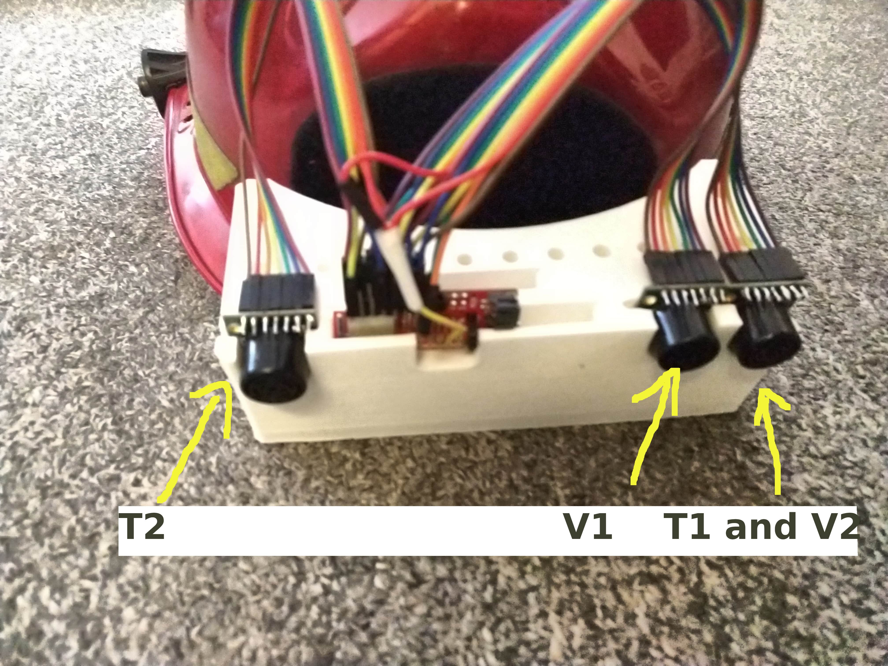
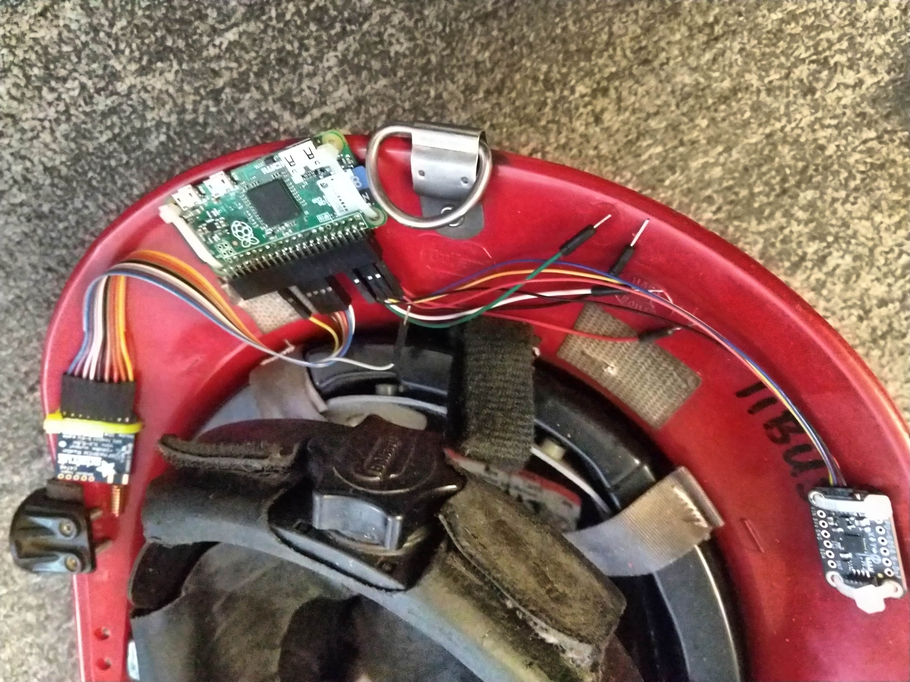
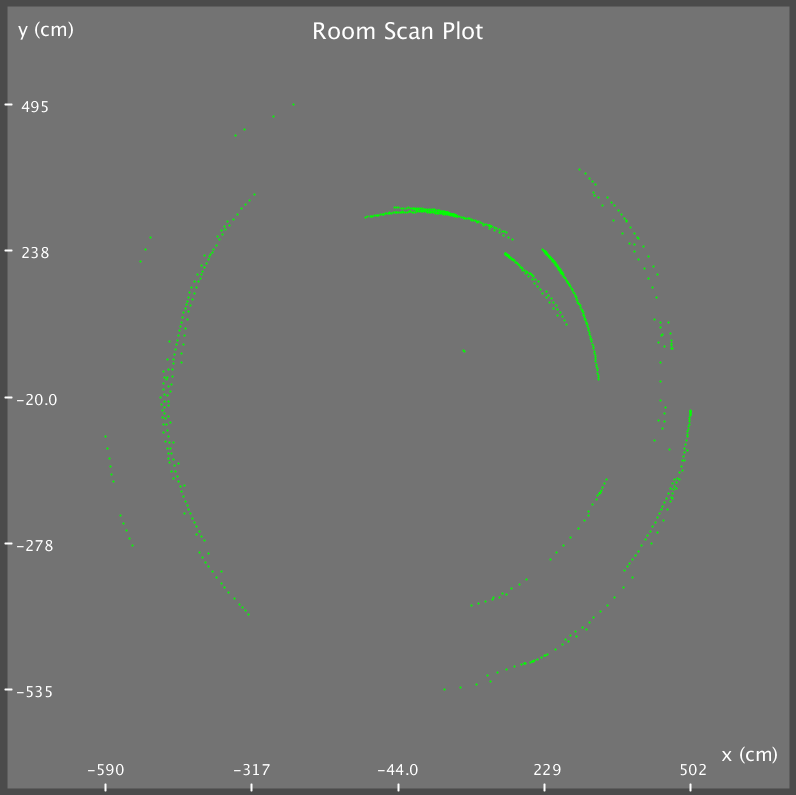

SmokeScreen is a smart fire helmet whose goal is to enable firefighters to navigate buildings in thick smoke.

### M.Eng. Project

**Achievements**

* 100% reliable radio communication through walls
* Complete acoustic model of arbitrary SONAR setup
* CAD model and ANSYS structural analysis
* Physical prototype
* Teamwork across 10 time zones

### Previous Classes

SmokeScreen began as a project for PHYS 3360: Electronic Circuits.
This lab-heavy class required students to construct an electronic project of their choice. Tim and his lab partner Phil built *sonar-mapper*, a device which, when spun in a circle, built a 2-D map of a room and saved the result to a file.
It earned an A+, but the teacher gave suggestions to improve it.

In MAE 4351, *sonar-mapper* became SmokeScreen as Tim's team built a case for firefighter's need of navigational help. Market research showed that not only are firefighters interested in such a device, but supervisors are willing to buy it. The estimated market potential was in the billions. The prototype was somewhat functional, producing results which were rather unhelpful in navigating unknown territory.

