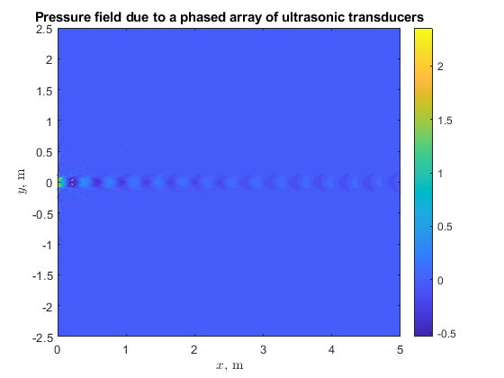
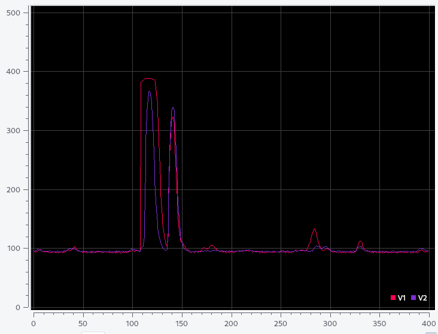
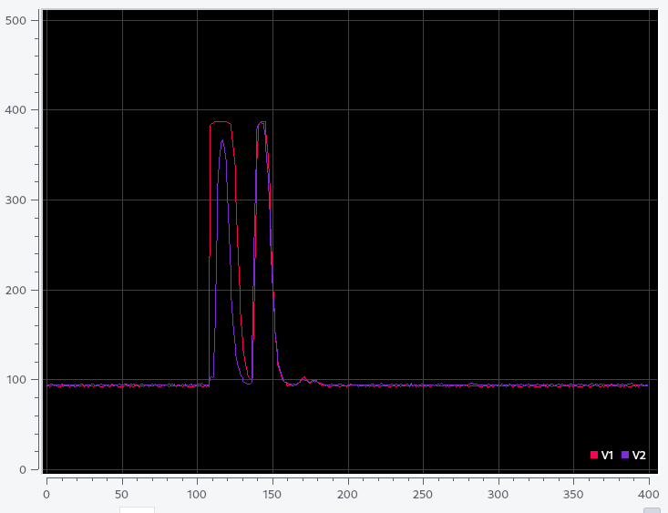

**SmokeScreen** will be a network of smart fire helmets allowing firefighters to quickly navigate buildings in thick smoke.

**Project Goal**: Show each firefighter a dynamic floorplan of the building around them, with dots or arrows showing other firefighters' locations, in a heads-up display attached to their helmet. Also send this image to the incident commander's computer, allowing them to better coordinate operations.

### M.Eng. Project

#### Achievements

* 100% reliable radio communication through walls
* Complete acoustic model of arbitrary SONAR setup
* CAD model and ANSYS structural analysis
* Physical prototype
* Teamwork across 10 time zones

Below are the results of the acoustic simulation, depicting a focused beam of 40kHz ultrasound.

Focusing the ultrasound beam was an attempt to solve the lack of corner detection described later.
The best method, however, was described in [a 1995 paper by Lindsay Kleeman and Roman Kuc](https://journals.sagepub.com/doi/10.1177/027836499501400401). Using two or more transducers and two or more receivers, their system could accurately determine the locations of walls, inside corners, and outside corners (which they call edges) in two dimensions. (Three-dimensional mapping was outside the scope of this short project.) This project outlined the means to implement Kleeman and Kuc's method in a smart fire helmet and built a proof-of-concept.

The following two pictures show the physical prototype: electronics attached to a retired fire helmet.

The below images compare echoes from a wall turned 30° to the left and a wall turned 30° to the right relative to the sensor. The first peak is the transmitted ping and the second is the returning ping. Note the time offsets of the second peaks: the angle of the wall can be determined using the difference in time-of-flight between the two peaks as described in [Kleeman and Kuc 1995](https://journals.sagepub.com/doi/10.1177/027836499501400401).

Left: wall on left. Right: wall on right.

 

[**Click here to access the project final report (79-page PDF).**](https://1drv.ms/b/s!AmJ2drz6YYLg5Rjl9aoMAtcGSi4i?e=lEf5vV)

## Previous Classes

SmokeScreen began as a project for PHYS 3360: Electronic Circuits.
This lab-heavy class required students to construct an electronic project of their choice. Tim and his lab partner Phil built *sonar-mapper*, a device which, when spun in a circle, built a 2-D map of a room and saved the result to a file. However, the wide beam did not register corners, so maps of square rooms appeared round.
It earned an A+, but the teacher gave suggestions to improve it.

In MAE 4351, *sonar-mapper* became SmokeScreen as Tim's team built a case for firefighter's need of navigational help. Market research showed that not only are firefighters interested in such a device, but supervisors are willing to buy it. The estimated market potential was in the billions. The horizontal, low-fidelity prototype was as functional as *sonar-mapper*, but was attached to a fire helmet and built a live plot on a computer screen.

