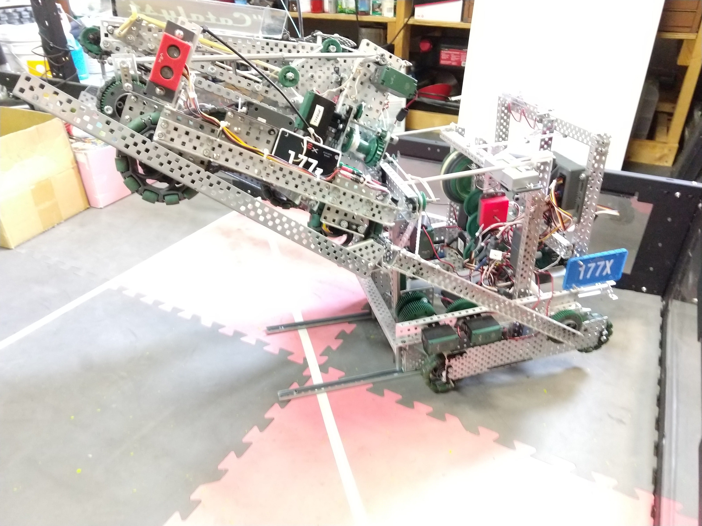

### Spitfire III



Tim chose to redesign [Spitfire 2.0](./177.html) for several reasons:

1. To hone his skills learned from Cornell.
2. For emotional closure after poor design decisions prevented Spitfire 2.0 from meeting its expectations.
3. For a programming rig to learn additional robotics and control system skills.
4. Because he enjoys building robots.

#### Achievements

* Spitfire III, weighing 18 lb., lifts robots up to ~15 lb. without flipping.
* Spitfire III shoots balls into the net with 100% accuracy unless the balls are defective.
* Spitfire III drives faster than any previous Twisted Botz robot without overheating its motors.

Videos coming soon!

#### New Flywheel Control Algorithm

```c
# include "main.h"

	// Declare variables specific to these functions
	float lastFive[5];			// Last five measured motor speeds (for filter)
	float rpm;					// Calculated speed, in rpm (unfiltered)
	float speed;				// Real motor speed, in rpm (filtered)
	float p = 0;				// Proportional term
	float pgain = 1.1;			// Proportional gain
	// For every 1 rpm deviation from the setpoint, the motor power is adjusted by 1.1.
	float d = 0;				// Derivative term
	float dgain = 0.004;		// Derivative gain
	// For every 10 rpm change in speed per cycle, the motor power is adjusted by 1.
	float dt = 0.050;			// Change in time in ms
	float prev_error;			// Old error for derivative (delta error / delta time)
	int output;					// Output motor power
	bool shoot = true;			// Is a ball being shot right now? Wakes up true
	//float value = 0;
	//float v0 = 0;	//Last value which was filtered
	
//bool jammed(){
//	// Detect ball jam by determining whether the intake will spin.
//	return (abs(5*motorGet(INTAKE) - intakeSpeed) > 400);
//}

//The VEX encoders are flaky, so the bot has accuracy issues with an unfiltered PID.
//Feed this function a number, and it filters it based on previous values.
float filter(float number){
	// Increment the index of each old value
	for(int i=4;i>0; i--){
		lastFive[i] = lastFive[i-1]; // counting down...
	} // because we don't want to overwrite anything.
	lastFive[0] = number;
	return (lastFive[0]+lastFive[1]+lastFive[2]+lastFive[3]+lastFive[4])/5;
	// OLD CODE: lag filter
	//Divide the difference between the old value and the new value by a set gain
	//value = v0 + ((number - v0)/3);
	//v0 = number;	//Update the old value
	//return value;
}

void flywheelRun()
{
	encoderReset(fwe);	//Reset encoder to make sure there is no spike when it passes 0
	while(true)
	{
		// Calculate rotational velocity of flywheel in RPM
		rpm = encoderGet(fwe)/0.3; // Convert from ticks/sec to rev/min
		speed = abs(filter(rpm * 5)); // Flywheel is geared up 5:1
		//writeDebugStreamLine("%4.2f, %2.2f, %2.2f, %i", speed, p, d, setpoint);
		
		
		// Calculate P and D terms
		error = setpoint - speed;	//Calculate error
		p = pgain * error;	//Proportional calculation (gain * error)
		
		//Feed forward code activated when firing a ball
		//if(ballDetect())
		//{
		//	shoot = true;
		//}
		//if(shoot && error < 80){ shoot = false;} // Feed forward period ends when error is small again
		//if(shoot){ d = 0;	} //Derivative off
		//else		
		d = dgain * (error - prev_error) / dt; // Calculate derivative: change in error / change in time
		
		
		// Output to the motors
		output = p + d;
		if(output < 0)	//Output floor (never want to reverse the motors)
			output = 0;
		if(output > 127)	//Output ceiling (can't go above 127)
			output = 127;
		motorSet(FW1,output); // Motor 1 spins CW
		motorSet(FW2,-output); // Motor 2 spins CCW
		motorSet(FW3,-output); // Motor 3 spins CCW
		
		// Prepare for next loop
		encoderReset(fwe); // Reset encoders for speed calculation (avoids overflow errors)
		delay(dt*1000);	// Wait some time to calculate speed
		prev_error = error;	// Make old error previous; will overwrite next execution
	}
}
```

#### Spitfire III in Action

